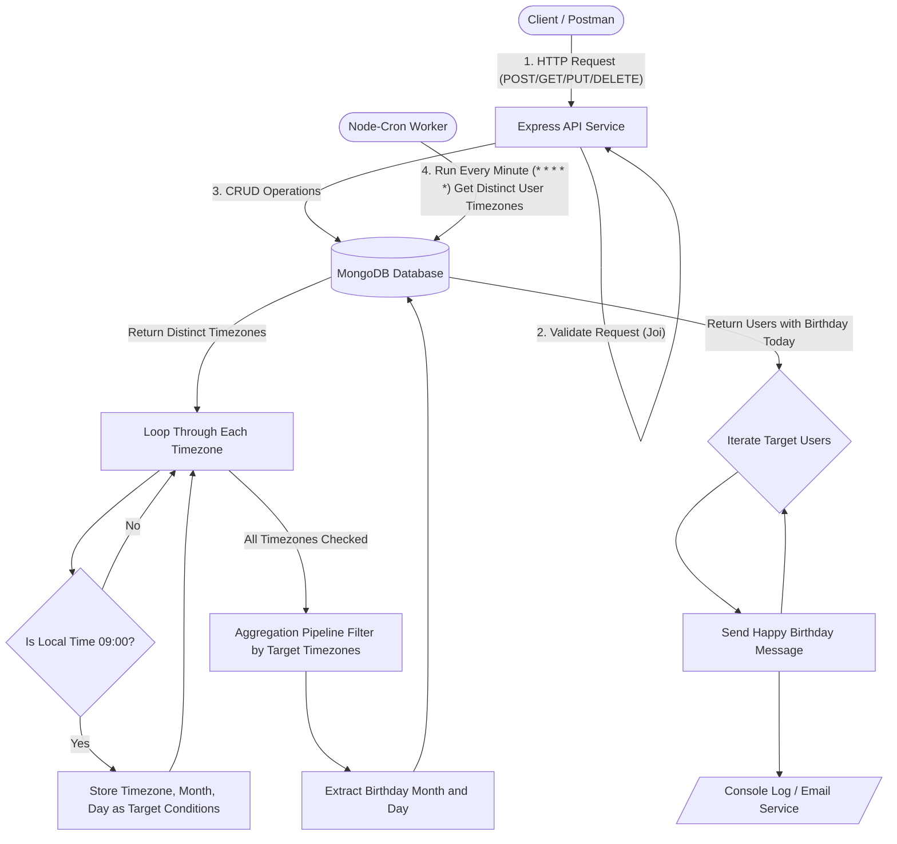

# Birthday Reminder Service

This project is a backend application that stores user data (with birthdays) and uses a worker process to automatically send a "Happy Birthday" message at 9 AM in their local time zone on their birthday.

## Technology Stack

- **Backend Framework:** Node.js with ExpressJS
- **Language:** TypeScript
- **Database:** MongoDB (using Mongoose)
- **Scheduling/Worker:** node-cron
- **Containerization:** Docker & Docker Compose
- **Testing:** Jest & Supertest

## Architecture

The application follows Clean Architecture and Domain-Driven Design (DDD) principles:

### Infrastructure & Process Flowchart



### Components
- **Controllers** handle HTTP requests and input validation (using Joi).
- **Services** encapsulate the core business logic.
- **Repositories** manage data access and database operations.
- **Models** define Mongoose schemas and TypeScript interfaces.

## Project Structure

```
├── Dockerfile
├── docker-compose.yml
├── package.json
├── src
│   ├── app.ts                  # Express application setup
│   ├── server.ts               # API server entry point
│   ├── worker.ts               # Worker entry point
│   ├── controllers             # Request handlers & validation
│   ├── models                  # Mongoose models
│   ├── repositories            # Database access
│   ├── routes                  # Express routes
│   ├── services                # Business logic & Cron scheduling
│   └── utils                   # DB connection & utilities
└── tests
    ├── user.test.ts            # Unit tests for API endpoints
    └── worker.test.ts          # Unit tests for the cron worker
```

## Running the Application with Docker

Prerequisites: Make sure you have Docker and Docker Compose installed.

1. **Build and start the containers**
   ```bash
   docker-compose up --build
   ```
   This will spin up three containers:
   - `mongodb`: The MongoDB database
   - `api_service`: The Express REST API
   - `worker_service`: The node-cron scheduling worker

2. **Access the API**
   The API will be accessible at `http://localhost:3000`.

## API Documentation & Examples

### 1. Create a User
**POST** `/user`
```json
{
  "name": "Jane Doe",
  "email": "jane@example.com",
  "birthday": "1990-05-15T00:00:00.000Z",
  "timezone": "America/New_York"
}
```

### 2. Get User by ID
**GET** `/user/:id`
Returns the user detail corresponding to the specific ID.

### 3. Update User
**PUT** `/user/:id`
```json
{
  "name": "Jane Updated",
  "timezone": "Asia/Jakarta"
}
```

### 4. Delete User
**DELETE** `/user/:id`
Removes the user from the database.

## Running Tests Locally

To run tests without Docker, you will need Node.js installed locally.

1. Install dependencies:
   ```bash
   npm install
   ```

2. Run the tests:
   ```bash
   npm test
   ```
   Tests use `mongodb-memory-server` for a fast, isolated database during testing.

## Notes: Assumptions, Limitations, and Design Decisions

### Assumptions
- **Payload Format:** It is assumed that API consumers will provide dates in strict ISO 8601 format. Timezones must be valid IANA timezone strings (e.g., `Asia/Jakarta`).
- **Simulated Message:** Sending a real email is out of scope. Therefore, the implementation currently simulates sending the birthday message via a console log statement.
- **Worker Independent:** The scheduling system operates on the assumption that the worker and API containers run continuously alongside each other without dropping process continuity. 

### Limitations
- **Downtime Vulnerability:** The cron worker currently checks for exactly 9:00 AM without stateful tracking. If the server experiences downtime at exactly 9:00 AM for any user's timezone, their message will be missed for that year.

### Design Decisions
- **Optimized Database Aggregation for Scale:** Instead of fetching all users into memory, the worker dynamically calculates in Node.js which timezones are currently at 9 AM, and executes a targeted MongoDB Aggregation Pipeline query using `$dateToParts`. This ensures the application remains highly scalable and memory-efficient even for millions of users.
- **Clean Architecture:** To strictly adhere to the *“Do not overengineer”* rule while keeping the app SOLID, a simple Controller-Service-Repository separation was used. It ensures testability and maintainability without creating unnecessary abstract classes or complex dependency injections.
- **In-Memory Scheduling over Message Queues:** A simple `node-cron` approach was chosen over complex messaging brokers (like Redis + BullMQ). Given the scale and functional requirements, a stateless minute-by-minute evaluation of user data natively with Node.js fulfills the need cleanly and resiliently.
- **Validation Library:** Migrated to `joi` for handling request schemas at the controller layer due to its strong error messaging features and robust ecosystem compatibility with ExpressJS.
- **Minute-by-minute Worker Execution:** The node-cron worker checks time every minute `(* * * * *)` rather than every hour to effectively catch users residing in "fractional timezones" (e.g., India `UTC+5:30`, Nepal `UTC+5:45`).
